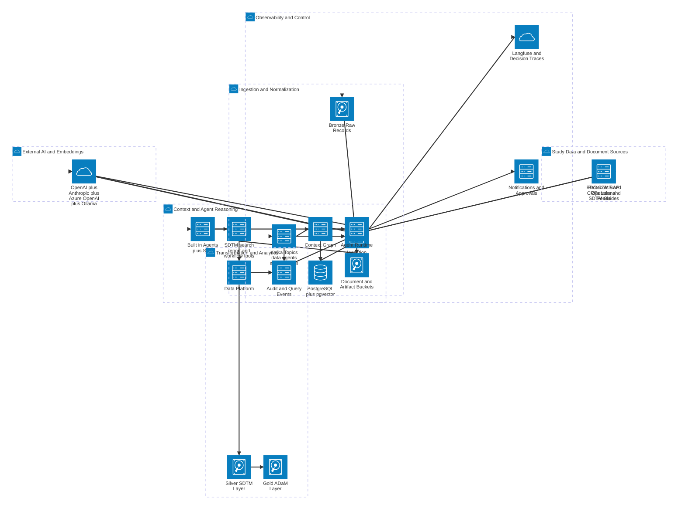
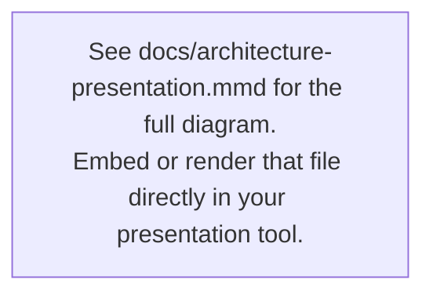

# Trialo Architecture

This document captures the current application architecture from the repo configuration and service code. It is intentionally split into two Mermaid diagrams so the platform topology stays readable while the AI and data pipeline gets a separate execution-focused view.

Raw Mermaid sources for renderers that expect Mermaid-only input are available in `docs/architecture-platform.mmd` and `docs/architecture-ai-data-pipeline.mmd`. If a tool throws `UnknownDiagramError` on this file, it is usually parsing the whole Markdown document as Mermaid instead of reading the fenced diagram blocks.

## Diagram 1: Platform Service Topology

## Diagram 2: AI and Data Pipeline View

## Diagram 3: Presentation-Grade Platform Overview

For leadership and client presentations use `docs/architecture-presentation.mmd`.
It is a single `flowchart TB` diagram with:

- **Color-coded subgraphs** — Users · Frontend · Gateway · Core Services · Data · Events · AI · External
- **Emoji icons** on every service node for instant visual scanning
- **Port numbers and tech stack** callouts on each service
- **`classDef` color classes** — blue (core), teal (frontend), purple (gateway), amber (data), sky (events), green (AI)
- Renders in GitHub, Mermaid Live Editor, Notion, Confluence, and VS Code Mermaid Preview

| Layer | Services | Technology |
|---|---|---|
| 👥 Users | Clinical Data Managers · Study Coordinators · Medical Reviewers · Admins | — |
| 🖥️ Frontend | Next.js 14 | App Router · Tailwind · ReactFlow |
| 🔀 Gateway | GraphQL API · Auth Service · OPA | Apollo · FastAPI · Auth0 |
| ⚙️ Core | Ingestion · Agent Runtime · Marketplace · Context Graph · Notifications · Audit · App Composer · Form Engine · Workflow Bridge | FastAPI · Node.js/Express |
| 🗄️ Data | PostgreSQL+pgvector · MongoDB · MinIO · Neo4j | pg16 · mongo7 · S3-compatible |
| ⚡ Events | Kafka · Zeebe · Elasticsearch · Camunda Operate | KRaft · BPMN 2.0 |
| 🧠 AI | OpenAI · Anthropic Claude · Azure OpenAI · Ollama · Langfuse | REST · LiteLLM compatible |
| 🌐 External | Auth0 · SendGrid | SSO/MFA · Email |

## Legend and Scope Notes

- `internet` icons mark user or network entry points.
- `server` icons represent application services or processing engines.
- `database` icons represent structured or vector-backed stores.
- `disk` icons represent object storage, documents, and pipeline layers.
- `cloud` icons represent external or grouped platform capabilities.

These diagrams reflect the current repo-backed runtime topology from the compose, service, and infrastructure definitions. They emphasize the main synchronous request paths and the major asynchronous/event-driven paths rather than every internal route, table, Helm object, or Kubernetes manifest.

## Mermaid Rendering Notes

- The diagrams use Mermaid `architecture-beta`, which requires Mermaid `v11.1+`.
- They deliberately stick to Mermaid built-in icons so they render even without custom icon registration.
- If your docs renderer registers Iconify packs, the generic `server`, `database`, `disk`, and `cloud` icons can be upgraded to branded icons for Next.js, GraphQL, Kafka, PostgreSQL, MongoDB, and related technologies without changing the diagram structure.